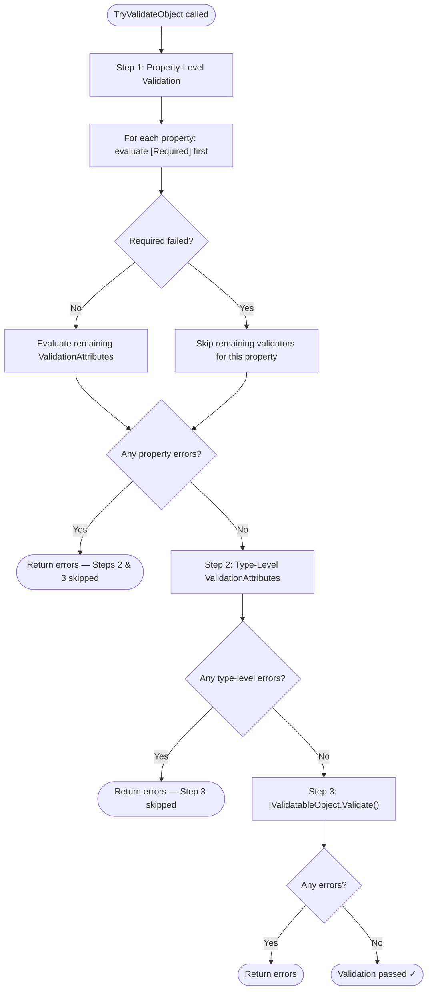

# Chapter 4: Programmatic (Manual) Validation

---
[<<-- Previous: Annotating Objects](03-annotating-objects.md) | [Table of Contents](README.md) | [Next: ASP.NET MVC Automatic Validation -->>](05-aspnet-mvc-validation.md)
---

The `Validator` class is the central orchestrator for programmatic validation in `System.ComponentModel.DataAnnotations`. It provides 7 static methods, grouped into three categories, that let you validate objects, properties, and standalone values on demand.

**Key References:**

- [Validator Class API](https://learn.microsoft.com/en-us/dotnet/api/system.componentmodel.dataannotations.validator?view=net-9.0)
- Source: [Validator.cs](https://github.com/dotnet/runtime/blob/main/src/libraries/System.ComponentModel.Annotations/src/System/ComponentModel/DataAnnotations/Validator.cs)

## Object Validation

The most common entry point. Two flavors — a try-pattern that collects all errors, and a throwing variant that stops at the first error.

```csharp
// Try-pattern: returns bool, collects errors
var results = new List<ValidationResult>();
var context = new ValidationContext(meeting);
bool isValid = Validator.TryValidateObject(meeting, context, results, validateAllProperties: true);

// Throws ValidationException on first error
Validator.ValidateObject(meeting, context, validateAllProperties: true);
```

### The validateAllProperties Parameter

This parameter controls the depth of validation and is a critical detail:

- **`false` (default):** Only `[Required]` attributes are checked. All other `ValidationAttribute` subclasses are ignored.
- **`true`:** All attributes on all properties are evaluated.

In most real-world usage, you want `validateAllProperties: true`. The default of `false` exists for backward compatibility and specific scenarios where only presence checking is needed.

## Property Validation

Validates a single property value against its declared attributes. You must set `MemberName` on the `ValidationContext` so the validator knows which property's metadata to look up.

```csharp
var context = new ValidationContext(meeting) { MemberName = "Title" };
var results = new List<ValidationResult>();
bool isValid = Validator.TryValidateProperty(meeting.Title, context, results);
```

## Value Validation

Validates a standalone value against a set of attributes you supply directly — no object or property metadata involved.

```csharp
var context = new ValidationContext(new object());
var attributes = new[] { new RangeAttribute(1, 100) };
var results = new List<ValidationResult>();
bool isValid = Validator.TryValidateValue(42, context, results, attributes);
```

## The 3-Stage Validation Pipeline

When `TryValidateObject` or `ValidateObject` runs, validation proceeds through a well-defined pipeline with short-circuit behavior between stages.



The key insight is **short-circuit behavior**: if Step 1 produces any errors, Steps 2 and 3 are skipped entirely. This is by design — entity-level validation (Steps 2 and 3) often assumes that all property-level constraints are already satisfied.

As Jeff Handley described in the original design:

> The validation stages are: (1) Required validators, (2) remaining property validators, (3) entity-level validators, (4) IValidatableObject.Validate().

Within Step 1, if a `[Required]` attribute fails on a property, the remaining attributes for that specific property are skipped — but other properties continue to be validated so all property-level errors are collected.

## Complete Working Example

```csharp
using System.ComponentModel.DataAnnotations;

public class UserProfile
{
    [Required(ErrorMessage = "Username is required")]
    [StringLength(20, MinimumLength = 3)]
    public string Username { get; set; } = string.Empty;

    [Required]
    [EmailAddress]
    public string Email { get; set; } = string.Empty;

    [Range(13, 120)]
    public int Age { get; set; }
}

// Construct and validate
var user = new UserProfile
{
    Username = "ab",
    Email = "not-an-email",
    Age = 10
};

var context = new ValidationContext(user);
var results = new List<ValidationResult>();
bool isValid = Validator.TryValidateObject(user, context, results, validateAllProperties: true);

// isValid == false
// results contains 3 validation errors
foreach (var result in results)
{
    Console.WriteLine($"{string.Join(", ", result.MemberNames)}: {result.ErrorMessage}");
}
```

Output:

```
Username: The field Username must be a string with a minimum length of 3 and a maximum length of 20.
Email: The Email field is not a valid e-mail address.
Age: The field Age must be between 13 and 120.
```

---
[<<-- Previous: Annotating Objects](03-annotating-objects.md) | [Table of Contents](README.md) | [Next: ASP.NET MVC Automatic Validation -->>](05-aspnet-mvc-validation.md)
---
