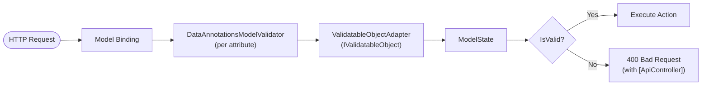

# Chapter 5: ASP.NET MVC Automatic Validation

---
[← Previous: Programmatic Validation](04-programmatic-validation.md) | [Table of Contents](README.md) | [Next: Advanced Custom Validation →](06-advanced-custom-validation.md)
---

ASP.NET MVC (and ASP.NET Core) integrates DataAnnotations validation directly into the model-binding pipeline, so validation happens automatically before your action code runs.

**Key References:**

- [Model Validation in ASP.NET Core MVC](https://learn.microsoft.com/en-us/aspnet/core/mvc/models/validation)
- [Add Validation to an ASP.NET Core MVC App](https://learn.microsoft.com/en-us/aspnet/core/tutorials/first-mvc-app/validation)

## How MVC Validates Automatically

The model-binding pipeline performs validation in a series of steps:

1. **Binds** incoming request data (form fields, JSON body, query strings) to the action parameter type
2. **Runs validation** against all `ValidationAttribute` instances declared on the model
3. **Populates `ModelState`** with the results — one entry per property, with errors attached
4. **Action checks `ModelState.IsValid`** to decide whether to proceed

**Important detail:** MVC does **not** call `Validator.TryValidateObject()`. Instead, `DataAnnotationsModelValidator` calls `Attribute.GetValidationResult(value, validationContext)` for each attribute individually. This is a distinct invocation path from the `Validator` class, which means some behaviors differ — notably around short-circuiting and the order of evaluation. This has significant implications for async validation — MVC's separate pipeline means it requires its own async changes, independent of any updates to the core `Validator` class. See [Chapter 11](11-integration-history.md) for the full history of how this and other integrations were built.



## Controller Example

```csharp
[ApiController]
[Route("api/[controller]")]
public class MeetingsController : ControllerBase
{
    [HttpPost]
    public IActionResult Create([FromBody] Meeting meeting)
    {
        if (!ModelState.IsValid)
        {
            return BadRequest(ModelState);
        }

        // Save the meeting...
        return Ok(meeting);
    }
}
```

When `[ApiController]` is applied, ASP.NET Core automatically returns a 400 Bad Request response **before the action body executes** if `ModelState.IsValid` is `false`. The explicit `if (!ModelState.IsValid)` check shown above is therefore redundant with `[ApiController]`, but is included for clarity and is required in non-API controllers.

## The [Remote] Attribute

```csharp
[Remote(action: "VerifyUsername", controller: "Users")]
public string Username { get; set; }
```

The `[Remote]` attribute generates client-side JavaScript that makes an AJAX call to the specified controller action whenever the field value changes. The server endpoint returns a JSON boolean or error message.

This is the closest thing to "async validation" in the current ecosystem, but it has significant limitations:

- **MVC-specific** — only works with ASP.NET MVC/Razor Pages views
- **Browser-only** — relies on jQuery Unobtrusive Validation
- **Not available server-side** — the `[Remote]` attribute is skipped during server-side validation entirely

**Reference:** [Remote Validation](https://learn.microsoft.com/en-us/aspnet/core/mvc/models/validation#remote-attribute)

## Blazor Forms Validation

Blazor takes a different approach from MVC, using the `Validator` class directly rather than going through MVC's model validator infrastructure.

- The `DataAnnotationsValidator` component attaches to an `EditContext`
- **On field changes:** calls `Validator.TryValidateProperty(...)` for the specific field
- **On form submit:** calls `Validator.TryValidateObject(...)` for the entire model
- `ValidationMessageStore` manages per-field error messages and coordinates with the UI

This means Blazor validation follows the 3-stage pipeline described in Chapter 4, including the short-circuit behavior. MVC validation does not.

**Reference:** [Blazor Forms Validation](https://learn.microsoft.com/en-us/aspnet/core/blazor/forms/validation)

## .NET 10: Microsoft.Extensions.Validation

Starting with .NET 10, the ASP.NET Core team extracted unified validation APIs into the `Microsoft.Extensions.Validation` NuGet package. This makes framework-level validation available outside of ASP.NET Core HTTP scenarios — in worker services, console apps, libraries, and anywhere `Microsoft.Extensions.DependencyInjection` is used.

```csharp
builder.Services.AddValidation();
```

This is **highly relevant** to the async validation project — it represents a new invocation point for DataAnnotations validation that needs to be considered in any design for async support.

**References:**

- [What's New in ASP.NET Core in .NET 10](https://learn.microsoft.com/en-us/aspnet/core/release-notes/aspnetcore-10.0)
- [Microsoft.Extensions.Validation NuGet](https://www.nuget.org/packages/Microsoft.Extensions.Validation)

---
[← Previous: Programmatic Validation](04-programmatic-validation.md) | [Table of Contents](README.md) | [Next: Advanced Custom Validation →](06-advanced-custom-validation.md)
---
