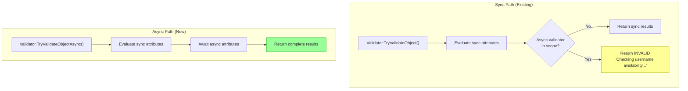

# Chapter 9: The Async Validation Gap

---
[← Previous: The ValidationResult API](08-validation-result-api.md) | [Table of Contents](README.md) | [Next: Strickland — Parallel Concepts and Async Validation →](10-strickland.md)
---

> **Key Concept:** The entire DataAnnotations validation system is synchronous. There is no async path anywhere in the current API.

## The Problem

Every validation extensibility point is synchronous:

| Interface/Method | Signature | Async? |
|------------------|-----------|--------|
| `ValidationAttribute.IsValid` | `ValidationResult? IsValid(object?, ValidationContext)` | ❌ Sync |
| `IValidatableObject.Validate` | `IEnumerable<ValidationResult> Validate(ValidationContext)` | ❌ Sync |
| `CustomValidationAttribute` methods | `ValidationResult Method(T, ValidationContext)` | ❌ Sync |
| `Validator.TryValidateObject` | `bool TryValidateObject(...)` | ❌ Sync |
| `Validator.ValidateObject` | `void ValidateObject(...)` | ❌ Sync |
| `IValidateOptions<T>.Validate` | `ValidateOptionsResult Validate(string?, T)` | ❌ Sync |

This means it's **impossible** to write validators that:

- Check database uniqueness (e.g., "Is this username available?")
- Call external APIs (e.g., address verification, fraud detection)
- Perform any I/O-bound validation

## Current Workarounds (and Why They're Insufficient)

1. **Block on async** — `.GetAwaiter().GetResult()` — causes deadlocks in synchronization contexts
2. **MVC [Remote] attribute** — AJAX-based, MVC-specific, browser-only
3. **Validate outside DataAnnotations** — Perform async checks separately, merge results manually
4. **IAsyncActionFilter** — ASP.NET MVC specific; doesn't integrate with DataAnnotations pipeline

None are satisfactory for general-purpose validation.

## The Proposed Design Tenet

> If synchronous validation is invoked, but there is an async validator in scope, validation must return an *invalid* result with a message that indicates validation did not complete.

Example: A `[UsernameAvailable]` validator:

- **Sync invocation:** `isValid: false`, message: `"Checking username availability..."`
- **Async invocation:** `isValid: false` initially, then resolves to the final result

## Extensibility Hooks That Need Async Versions

| Current Sync API | Proposed Async Version |
|------------------|------------------------|
| `ValidationAttribute.IsValid(object?, ValidationContext)` | `IsValidAsync(object?, ValidationContext, CancellationToken)` |
| `IValidatableObject.Validate(ValidationContext)` | `IAsyncValidatableObject.ValidateAsync(ValidationContext, CancellationToken)` |
| `CustomValidationAttribute` method signatures | Support `Task<ValidationResult>` return types |
| `Validator.TryValidateObject(...)` | `Validator.TryValidateObjectAsync(...)` |
| `Validator.ValidateObject(...)` | `Validator.ValidateObjectAsync(...)` |
| `Validator.TryValidateProperty(...)` | `Validator.TryValidatePropertyAsync(...)` |
| `Validator.TryValidateValue(...)` | `Validator.TryValidateValueAsync(...)` |
| `IValidateOptions<T>.Validate(...)` | `IValidateOptions<T>.ValidateAsync(...)` |

## Proposed Architecture

The following diagram shows how sync and async paths would coexist:

## What the Async Validation Project Must Touch

Every invocation point across the .NET product suite must gain async support. The key ones:

1. **`System.ComponentModel.Annotations`** — Core Validator class and attribute base classes
2. **`Microsoft.Extensions.Options`** — DataAnnotationValidateOptions and source generator
3. **ASP.NET Core MVC** — DataAnnotationsModelValidator and ValidatableObjectAdapter
4. **Blazor** — EditContextDataAnnotationsExtensions
5. **Microsoft.Extensions.Validation (.NET 10)** — New unified validation APIs
6. **OpenAPI** — Schema generation may need to represent async validators

See [Chapter 11](11-integration-history.md) for the full chronological history of how each integration was added, and [Appendix A](appendix-a-integration-points.md) for the complete 11-tier catalog.

> **Prototype available:** A working async validation demo already exists — see [Chapter 12](12-async-validation-demo.md) for a detailed analysis of the `AsyncValidationAttribute`, `IAsyncValidatableObject`, and the two-phase validation strategy implemented in the [`oroztocil/validation-demo`](https://github.com/dotnet/aspnetcore/tree/oroztocil/validation-demo) branch.

---
[← Previous: The ValidationResult API](08-validation-result-api.md) | [Table of Contents](README.md) | [Next: Strickland — Parallel Concepts and Async Validation →](10-strickland.md)
---
