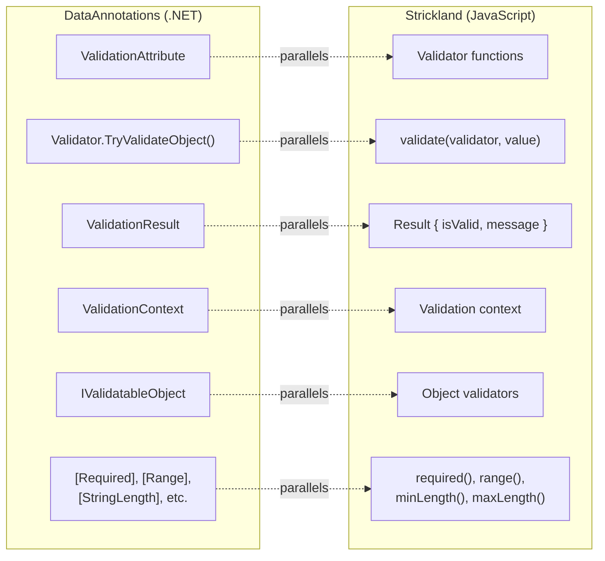

# Chapter 10: Strickland — Parallel Concepts and Async Validation

<nav>

<a href="09-async-validation-gap.md">← Previous: The Async Validation Gap</a> | <a href="README.md">Table of Contents</a> | <a href="11-integration-history.md">Next: The History of DataAnnotations Integration Across .NET →</a>

</nav>

> **Key References:** [Strickland][strickland-docs] / [GitHub][strickland-github] · [Inspiration][strickland-inspiration] · [Two-Stage Sync/Async][strickland-two-stage] · [Design Goals][strickland-design-goals] · [NPM][strickland-npm]

## Background

**Strickland** is a JavaScript validation framework born out of the DataAnnotations validation work done during the .NET RIA Services era (2009–2012), when APIs like `IValidatableObject`, `ValidationResult`, `ValidationContext`, and `Validator` were designed. From the [Inspiration page][strickland-inspiration]:

> After working on validation in .NET, the author wanted to bring the same principled approach to JavaScript — with the addition of first-class async validation that DataAnnotations never had.

Strickland embodies the same validation philosophy as DataAnnotations with a critical addition: **first-class async validation**.

## Parallel Concepts



| DataAnnotations | Strickland |
|-----------------|------------|
| `ValidationAttribute` (derives from it) | Validator functions (pure functions) |
| `Validator.TryValidateObject()` | `validate(validator, value)` |
| `ValidationResult` with `IsValid` + `ErrorMessage` | Result objects with `isValid` + `message` |
| `ValidationContext` (items, services) | Context object passed to validators |
| `IValidatableObject` (self-validation) | Object validators compose field validators |
| `[Required]`, `[Range]`, `[StringLength]` | `required()`, `range()`, `minLength()`, `maxLength()` |
| No async support ❌ | Full async via Promises ✅ |

## Strickland's Three Separation of Concerns

1. **Validation Rules** — The logic of how data is validated (validator functions)
2. **Validation Triggers** — Events that trigger validation (Strickland is uninvolved)
3. **Validation Results** — Presented to the user (consistent result structure)

This mirrors DataAnnotations where:

1. `ValidationAttribute` defines rules
2. Application models (MVC, Blazor) define triggers
3. `ValidationResult` defines output

## Strickland's Core: Validators Are Functions

```javascript
import validate from 'strickland';

function letterA(value) {
    return (value === 'A');
}

const result = validate(letterA, 'B');
// result = { isValid: false, value: 'B' }
```

Results are normalized: always objects with `isValid` and `value`. Booleans, objects, anything truthy/falsy gets normalized.

## The Key Innovation: Two-Stage Sync/Async Validation

**This is the concept most directly relevant to the DataAnnotations async project.**

### Stage 1: Synchronous validation returns immediately with `isValid: false`

```javascript
function usernameAvailable(username) {
    return {
        isValid: false,
        message: `Checking availability of "${username}"...`,
        validateAsync: () => fetch(`/api/check-username/${username}`)
            .then(response => response.json())
            .then(({ isAvailable }) => ({
                isValid: isAvailable,
                message: isAvailable
                    ? `"${username}" is available`
                    : `"${username}" is not available`
            }))
    };
}
```

### Stage 2: Async resolution produces the final result

```javascript
import { validateAsync } from 'strickland';

const result = await validateAsync(usernameAvailable, 'marty');
// result = { isValid: true, message: '"marty" is available', value: 'marty' }
```

## Mapping to Proposed DataAnnotations Design

| Strickland | Proposed DataAnnotations |
|------------|--------------------------|
| Sync `validate()` returns `{ isValid: false, message: "Checking..." }` | Sync `TryValidateObject()` must not succeed when async validators are in scope (throw or return invalid — design TBD) |
| `validateAsync` property holds a Promise | `IsValidAsync()` returns `Task<ValidationResult>` |
| `validateAsync()` resolves the Promise | `TryValidateObjectAsync()` awaits all async validators |

## Strickland's Design Goals (Relevant to DataAnnotations)

From the [design goals][strickland-design-goals]:

1. **Validators must operate synchronously AND asynchronously** — Same definition works in both modes
2. **Validation decoupled from UI** — Validators don't know about forms or components
3. **Validation is stateless** — Pure functions; state comes from context
4. **Extensibility is paramount** — Any logic should be expressible

These should inform the DataAnnotations async design.

## Deferred Async Validation

Strickland also supports **deferred** async validation — returning a function instead of a Promise:

```javascript
function usernameAvailable(username) {
    return {
        isValid: false,
        message: `Checking availability of "${username}"...`,
        validateAsync: () => () => fetch(`/api/check-username/${username}`)
            .then(/* ... */)
    };
}
```

The outer function is a "deferred" validator — it doesn't execute until explicitly called. This pattern could inform DataAnnotations designs where async validation should be opt-in at invocation time.

Reference: [Strickland: Deferred Async Validation][strickland-deferred-async]

<nav>

<a href="09-async-validation-gap.md">← Previous: The Async Validation Gap</a> | <a href="README.md">Table of Contents</a> | <a href="11-integration-history.md">Next: The History of DataAnnotations Integration Across .NET →</a>

</nav>

[strickland-docs]: https://strickland.io
[strickland-github]: https://github.com/jeffhandley/strickland
[strickland-inspiration]: https://github.com/jeffhandley/strickland/blob/master/docs/inspiration.md
[strickland-two-stage]: https://github.com/jeffhandley/strickland/blob/master/docs/async-validation/two-stage-sync-async-validation.md
[strickland-design-goals]: https://github.com/jeffhandley/strickland/blob/master/docs/design-goals.md
[strickland-npm]: https://www.npmjs.com/package/strickland
[strickland-deferred-async]: https://github.com/jeffhandley/strickland/blob/master/docs/async-validation/deferred-async-validation.md
