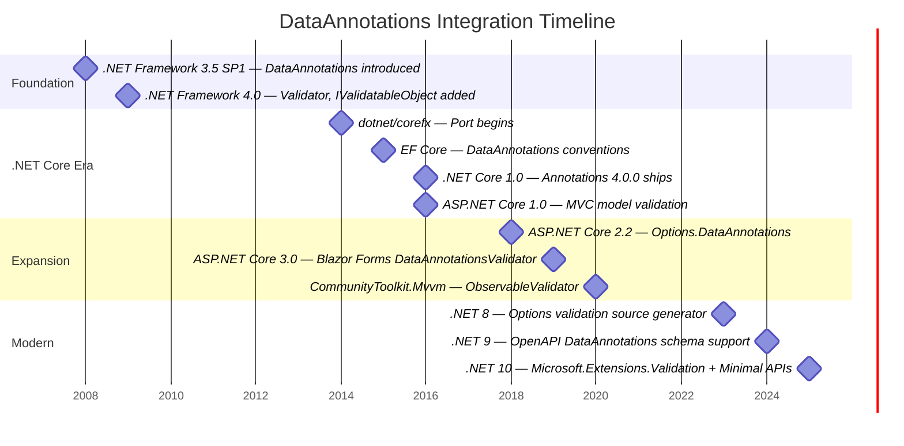

# Chapter 11: The History of DataAnnotations Integration Across .NET

---
[← Previous: Strickland — Parallel Concepts and Async Validation](10-strickland.md) | [Table of Contents](README.md) | [Next: The Async Validation Prototype →](12-async-validation-demo.md)
---

> **Key Concept:** DataAnnotations has been integrated into 11 distinct application models across the .NET product suite since 2016 — every single one is synchronous at the DataAnnotations level.

## Introduction

Understanding the history of how DataAnnotations validation was integrated across the .NET product suite is essential context for any async validation effort. Each integration point represents a place in the product that must be evaluated, updated, or at minimum made compatible with asynchronous validation. Some of these integrations call `Validator.TryValidateObject()` directly. Others have built their own pipelines on top of `ValidationAttribute.GetValidationResult()`. Still others only read validation attributes as metadata for schema generation. The path to async validation is different for each one.

This chapter traces the chronological history of every major DataAnnotations integration, documenting when it shipped, which repository it lives in, how it invokes validation, and what async support would require for each.

## Timeline

## Integration Points

### 1. The Foundation: .NET Framework (2008–2012)

**Introduced:** .NET Framework 3.5 SP1 (2008), expanded in .NET Framework 4.0 (2009)

DataAnnotations was originally introduced in .NET Framework 3.5 SP1 as part of ASP.NET Dynamic Data. The initial release included the `ValidationAttribute` base class and a set of built-in attributes like `[Required]`, `[StringLength]`, and `[RegularExpression]`.

.NET Framework 4.0, driven by the RIA Services effort, added the critical pieces that form today's validation infrastructure:

- `Validator` static class with `TryValidateObject()`, `TryValidateProperty()`, and `TryValidateValue()`
- `IValidatableObject` interface for object-level cross-property validation
- `ValidationContext` for passing service provider and contextual items into validation

**Validation invocation:** `Validator.TryValidateObject()` and related static methods — all synchronous from inception.

**Async implications:** These are the foundational APIs. Adding async means introducing `ValidatorAsync.TryValidateObjectAsync()` (or equivalent) and `IAsyncValidatableObject` alongside the existing sync surface. Every downstream integration inherits the sync constraint from here.

### 2. The Port to .NET Core (2014–2016)

**Introduced:** Port began in late 2014 in `dotnet/corefx`, shipped as `System.ComponentModel.Annotations` 4.0.0 with .NET Core 1.0 in June 2016

**Repository:** [dotnet/corefx](https://github.com/dotnet/corefx) (archived) → [dotnet/runtime](https://github.com/dotnet/runtime)

The port from .NET Framework to .NET Core brought `System.ComponentModel.DataAnnotations` into the open-source world. The package shipped as a standalone NuGet package (`System.ComponentModel.Annotations`) through several versions:

- 4.0.0 — .NET Core 1.0
- 4.3.0 — .NET Core 1.1
- 4.4.0, 4.5.0 — .NET Core 2.x
- 5.0.0 — .NET 5
- Included in the shared framework from .NET 6 onward (no longer a separate NuGet for modern TFMs)

Issue [dotnet/runtime#20200](https://github.com/dotnet/runtime/issues/20200) tracked porting gaps — places where .NET Framework behavior was not fully replicated in the .NET Core port.

**Validation invocation:** Identical to .NET Framework — `Validator.TryValidateObject()`, `TryValidateProperty()`, `TryValidateValue()`.

**Async implications:** This is where the core async changes must land. The `Validator` class, `ValidationAttribute`, `IValidatableObject`, and `ValidationContext` all live in `src/libraries/System.ComponentModel.Annotations/` within dotnet/runtime.

### 3. ASP.NET Core MVC Model Validation (2015–2016)

**Introduced:** ASP.NET Core 1.0 (June 2016), development began in 2015

**Repository:** `aspnet/Mvc` (archived) → [dotnet/aspnetcore](https://github.com/dotnet/aspnetcore)

MVC model validation was a launch feature of ASP.NET Core 1.0. This is arguably the most important consumer of DataAnnotations — and it has a critical architectural detail.

**CRITICAL:** ASP.NET Core MVC does **NOT** use `Validator.TryValidateObject()`. Instead, it has its own validation pipeline built around `DataAnnotationsModelValidator`, which calls `ValidationAttribute.GetValidationResult()` on each attribute individually. MVC walks the object graph itself, manages its own `ModelStateDictionary`, and applies its own recursive validation logic through `IObjectModelValidator` and `ValidationVisitor`.

This means MVC has a **separate validation pipeline** from the `Validator` class. Changes to `Validator.TryValidateObject()` alone will not automatically benefit MVC.

**Validation invocation:** `DataAnnotationsModelValidator.Validate()` → `ValidationAttribute.GetValidationResult()` per attribute, per property, per object in the model graph. Does not call `Validator.TryValidateObject()`.

**Async implications:** MVC's `IModelValidator.Validate()` method is synchronous. Making MVC support async validation requires:
- An `IAsyncModelValidator` interface (or making `Validate` return `ValueTask`)
- Updates to `ValidationVisitor` to support async traversal
- Updates to `DataAnnotationsModelValidator` to call async validation methods on attributes
- This is a substantial effort given MVC's deeply synchronous validation pipeline

### 4. EF Core DataAnnotations Conventions (2015)

**Introduced:** EF Core 1.0 development (2015), shipped June 2016

**Repository:** [dotnet/efcore](https://github.com/dotnet/efcore)

**Key PRs:**
- [dotnet/efcore#2463](https://github.com/dotnet/efcore/pull/2463) — Initial DataAnnotations conventions
- [dotnet/efcore#2515](https://github.com/dotnet/efcore/pull/2515) — Additional convention support
- [dotnet/efcore#2614](https://github.com/dotnet/efcore/pull/2614) — Further refinements

**Design issue:** [dotnet/efcore#107](https://github.com/dotnet/efcore/issues/107)

EF Core uses DataAnnotations attributes for **schema definition only** — mapping entities to tables, defining keys, setting column lengths, and configuring relationships. It reads attributes like `[Key]`, `[Required]`, `[MaxLength]`, `[Table]`, and `[Column]` to configure the model during `OnModelCreating`.

EF Core does **NOT** call `Validator.TryValidateObject()`. It does not perform runtime validation through the DataAnnotations validation pipeline. The attributes are metadata for the model builder, not validation triggers.

**Validation invocation:** None — EF Core reads attribute metadata but does not invoke validation.

**Async implications:** EF Core does not need async validation support per se. However, if new async-specific validation attributes are introduced (e.g., `[AsyncRequired]`), EF Core's convention classes must understand them for schema mapping purposes. This is a metadata concern, not a runtime validation concern.

### 5. Options.DataAnnotations (2018)

**Introduced:** ASP.NET Core 2.2 (December 2018)

**Repository:** [dotnet/aspnetcore](https://github.com/dotnet/aspnetcore) (originally), now in [dotnet/runtime](https://github.com/dotnet/runtime) under `Microsoft.Extensions.Options.DataAnnotations`

**Key issue:** [dotnet/aspnetcore#3385](https://github.com/dotnet/aspnetcore/issues/3385)

The `ValidateDataAnnotations()` extension method on `OptionsBuilder<T>` added DataAnnotations validation to the options pattern. When combined with `ValidateOnStart()`, options are validated during host startup.

The implementation class `DataAnnotationValidateOptions<T>` calls `Validator.TryValidateObject()` directly, passing `validateAllProperties: true`.

`IServiceProvider` passthrough was added in PR [dotnet/extensions#3032](https://github.com/dotnet/extensions/pull/3032), allowing validation attributes to resolve services from the DI container via `ValidationContext.GetService()`.

**Validation invocation:** `Validator.TryValidateObject(options, validationContext, results, validateAllProperties: true)` — direct call.

**Async implications:** `IValidateOptions<T>.Validate()` is synchronous. An `IAsyncValidateOptions<T>` with `ValidateAsync()` would be needed. The startup validation path (`ValidateOnStart()`) already runs during host initialization, so making it async is architecturally feasible — the host startup pipeline supports async operations.

### 6. Blazor Forms and DataAnnotationsValidator (2019)

**Introduced:** ASP.NET Core 3.0 Preview 3 (February 2019)

**Repository:** [dotnet/aspnetcore](https://github.com/dotnet/aspnetcore)

**Key PR:** [dotnet/aspnetcore#7614](https://github.com/dotnet/aspnetcore/pull/7614) by SteveSandersonMS

This PR introduced the Blazor forms and validation infrastructure:
- `EditContext` — tracks form state and validation messages
- `EditForm` — component that wraps a form with an `EditContext`
- `DataAnnotationsValidator` — component that hooks into `EditContext` events to run DataAnnotations validation
- Input components (`InputText`, `InputNumber`, etc.) — bind to model properties and trigger field validation

`DataAnnotationsValidator` uses `Validator.TryValidateProperty()` for individual field changes (triggered by `OnFieldChanged`) and `Validator.TryValidateObject()` for full form submission (triggered by `OnValidationRequested`).

**NOTABLE:** Steve Sanderson explicitly wrote in PR #7614:

> "Further enhancements planned: Async validation. I have a design in mind..."

This was **never implemented**. Six years later, Blazor Forms validation remains fully synchronous.

**Validation invocation:** `Validator.TryValidateProperty()` for field-level, `Validator.TryValidateObject()` for form-level — direct calls.

**Async implications:** Blazor's component model is inherently async (`OnInitializedAsync`, `OnParametersSetAsync`). The `EditContext` events (`OnFieldChanged`, `OnValidationRequested`) are synchronous delegates. Async validation would require:
- Async event support in `EditContext`
- An `AsyncDataAnnotationsValidator` component (or updating the existing one)
- UI state management during async validation (loading indicators, disabling submit)

### 7. WPF/WinForms via INotifyDataErrorInfo and ObservableValidator (2019–2020)

**Introduced:** `INotifyDataErrorInfo` pattern has existed since .NET Framework 4.5; `CommunityToolkit.Mvvm` `ObservableValidator` released September 2020

**Repository:** [CommunityToolkit/dotnet](https://github.com/CommunityToolkit/dotnet)

WPF and WinForms do not have a built-in `DataAnnotationsValidator` component. Instead, they rely on the `INotifyDataErrorInfo` interface for data binding validation. MVVM frameworks bridge the gap.

`CommunityToolkit.Mvvm`'s `ObservableValidator` class wraps `Validator.TryValidateProperty()` to validate individual properties when they change, raising `ErrorsChanged` events that WPF data binding consumes to display validation errors.

**Validation invocation:** `Validator.TryValidateProperty()` — direct call within `ObservableValidator`.

**Async implications:** `INotifyDataErrorInfo.GetErrors()` returns `IEnumerable` — synchronous by design. WPF's binding engine consumes errors synchronously. An async-compatible MVVM validator would need to:
- Validate asynchronously on property change
- Cache results and raise `ErrorsChanged` when complete
- Handle the UI displaying a "validating..." state during async validation
- This is primarily a toolkit/framework concern rather than a runtime concern

### 8. Options Validation Source Generator (2023)

**Introduced:** .NET 8 (November 2023)

**Repository:** [dotnet/runtime](https://github.com/dotnet/runtime)

**Key PR:** [dotnet/runtime#87587](https://github.com/dotnet/runtime/pull/87587)

The `[OptionsValidator]` attribute triggers a Roslyn source generator that emits validation code at compile time, avoiding the reflection overhead of `Validator.TryValidateObject()`. The generated code calls `Validator.TryValidateValue()` per property with the property's validation attributes.

The generated code in `Emitter.cs` produces synchronous `Validate()` methods that return `ValidateOptionsResult`.

**Validation invocation:** Generated code calls `Validator.TryValidateValue()` per property — compile-time generated, synchronous.

**Async implications:** The source generator's `Emitter.cs` must be updated to emit `ValidateAsync()` methods alongside the existing `Validate()` methods. The generator must also understand new async validation attributes and emit appropriate `await` expressions. This is a code generation concern — the generator must produce async code paths.

### 9. OpenAPI Schema Support (2024)

**Introduced:** .NET 9 (November 2024)

**Repository:** [dotnet/aspnetcore](https://github.com/dotnet/aspnetcore)

**Key PR:** [dotnet/aspnetcore#56225](https://github.com/dotnet/aspnetcore/pull/56225)

`Microsoft.AspNetCore.OpenApi` reads DataAnnotations attributes to generate OpenAPI schema metadata. It maps:
- `[Required]` → `required` in the schema
- `[Range]` → `minimum`/`maximum`
- `[StringLength]`/`[MaxLength]`/`[MinLength]` → `minLength`/`maxLength`
- `[RegularExpression]` → `pattern`
- `[Url]`/`[EmailAddress]`/`[Phone]` → `format`

This is a **metadata-only** consumer. It reads attributes at startup to build schemas — it does not perform runtime validation.

**Validation invocation:** None — reads attribute metadata only, does not invoke validation.

**Async implications:** Like EF Core, OpenAPI schema generation does not need async validation support. However, if new validation attributes are introduced as part of the async effort, the OpenAPI transformer must be updated to understand them for schema generation purposes.

### 10. Microsoft.Extensions.Validation and Minimal API Validation (2025)

**Introduced:** .NET 10 (preview, 2025)

**Repository:** [dotnet/aspnetcore](https://github.com/dotnet/aspnetcore)

**Key PR:** [dotnet/aspnetcore#60724](https://github.com/dotnet/aspnetcore/pull/60724)

**Design issue:** [dotnet/aspnetcore#46349](https://github.com/dotnet/aspnetcore/issues/46349)

This is the newest integration point and the **closest to async-ready**. `Microsoft.Extensions.Validation` provides a `ValidateAsync()` method that is itself async, but it calls synchronous `ValidationAttribute.IsValid()` underneath. The package was designed for Minimal API endpoint validation in .NET 10.

The async method signature means the pipeline is already structured to support truly async validation — but the actual validation attribute invocation remains synchronous.

**Validation invocation:** `ValidateAsync()` → calls `ValidationAttribute.IsValid()` synchronously within an async pipeline.

**Async implications:** This integration is architecturally prepared for async. If `ValidationAttribute` gains an `IsValidAsync()` method, `Microsoft.Extensions.Validation` can adopt it with minimal structural changes. The async pipeline already exists — only the leaf-level attribute invocation needs to become async.

### 11. .NET Aspire (Consumer)

**Introduced:** .NET Aspire 8.0+ (2024)

**Repository:** [dotnet/aspire](https://github.com/dotnet/aspire)

.NET Aspire is not a new integration point for DataAnnotations — it uses the existing `Options.DataAnnotations` pattern. Aspire components configure options with `ValidateDataAnnotations()` and `ValidateOnStart()` to validate configuration during host startup.

Aspire is listed here because it is a significant and growing consumer of the options validation pattern. Any changes to `Options.DataAnnotations` or the options validation source generator directly affect the Aspire developer experience.

**Validation invocation:** Via `DataAnnotationValidateOptions<T>` → `Validator.TryValidateObject()` (same as Options.DataAnnotations).

**Async implications:** Same as Options.DataAnnotations — benefits automatically from any async support added to the options validation pipeline.

## Summary Table

| # | Integration | Repository | First Shipped | Invocation Method | Sync Only? |
|---|-------------|------------|---------------|-------------------|------------|
| 1 | System.ComponentModel.DataAnnotations | dotnet/runtime | .NET Core 1.0 (Jun 2016) | `Validator.TryValidateObject/Property/Value()` | ✅ Yes |
| 2 | ASP.NET Core MVC Model Validation | dotnet/aspnetcore | ASP.NET Core 1.0 (Jun 2016) | `DataAnnotationsModelValidator` → `ValidationAttribute.GetValidationResult()` | ✅ Yes |
| 3 | EF Core DataAnnotations Conventions | dotnet/efcore | EF Core 1.0 (Jun 2016) | Metadata only — no runtime validation | N/A (metadata) |
| 4 | Options.DataAnnotations | dotnet/runtime | ASP.NET Core 2.2 (Dec 2018) | `Validator.TryValidateObject()` | ✅ Yes |
| 5 | Blazor Forms DataAnnotationsValidator | dotnet/aspnetcore | ASP.NET Core 3.0 Preview 3 (Feb 2019) | `Validator.TryValidateObject/Property()` | ✅ Yes |
| 6 | WPF/WinForms — ObservableValidator | CommunityToolkit/dotnet | CommunityToolkit.Mvvm 7.0 (Sep 2020) | `Validator.TryValidateProperty()` | ✅ Yes |
| 7 | Options Validation Source Generator | dotnet/runtime | .NET 8 (Nov 2023) | Generated `Validator.TryValidateValue()` calls | ✅ Yes |
| 8 | OpenAPI Schema Support | dotnet/aspnetcore | .NET 9 (Nov 2024) | Metadata only — no runtime validation | N/A (metadata) |
| 9 | Microsoft.Extensions.Validation | dotnet/aspnetcore | .NET 10 (2025) | `ValidateAsync()` → sync `IsValid()` | ✅ Yes (at attribute level) |
| 10 | Minimal API Validation | dotnet/aspnetcore | .NET 10 (2025) | Via Microsoft.Extensions.Validation | ✅ Yes (at attribute level) |
| 11 | .NET Aspire (consumer) | dotnet/aspire | Aspire 8.0 (2024) | Via Options.DataAnnotations | ✅ Yes |

## Observations for the Async Validation Project

- **Every integration is synchronous at the DataAnnotations level.** Even `Microsoft.Extensions.Validation` in .NET 10, which has an async pipeline, calls synchronous `ValidationAttribute.IsValid()` underneath.
- **MVC has its own pipeline, separate from the `Validator` class.** Adding async to `Validator.TryValidateObjectAsync()` does not automatically give MVC async validation — MVC's `DataAnnotationsModelValidator` and `ValidationVisitor` must be updated independently.
- **Blazor explicitly planned for async validation but never implemented it.** Steve Sanderson's 2019 PR comment about having "a design in mind" for async validation remains unimplemented six years later. The Blazor component model is inherently async, making it a natural fit.
- **The Options validation source generator emits code — the generator must be updated.** Unlike runtime integrations that call `Validator` methods, the source generator produces code at compile time. `Emitter.cs` must be updated to emit async validation code paths alongside existing sync code.
- **OpenAPI and EF Core are metadata consumers.** They need to understand new validation attributes for schema/model mapping but do not need async invocation support. These are lower-priority but must not be forgotten.
- **`Microsoft.Extensions.Validation` in .NET 10 is the closest to async-ready.** Its `ValidateAsync()` pipeline already has the async shape — only the leaf-level attribute invocation needs to become truly async.
- **The community toolkit (ObservableValidator) and Aspire are downstream consumers.** Changes to the core validation infrastructure will cascade to these projects, but they do not require coordinated changes in the same release.
- **11 integration points means 11 places to evaluate.** Not all need changes in the same release, but every one must be accounted for in the async validation design to avoid leaving sync-only gaps that block adoption.

---
[← Previous: Strickland — Parallel Concepts and Async Validation](10-strickland.md) | [Table of Contents](README.md) | [Next: The Async Validation Prototype →](12-async-validation-demo.md)
---
