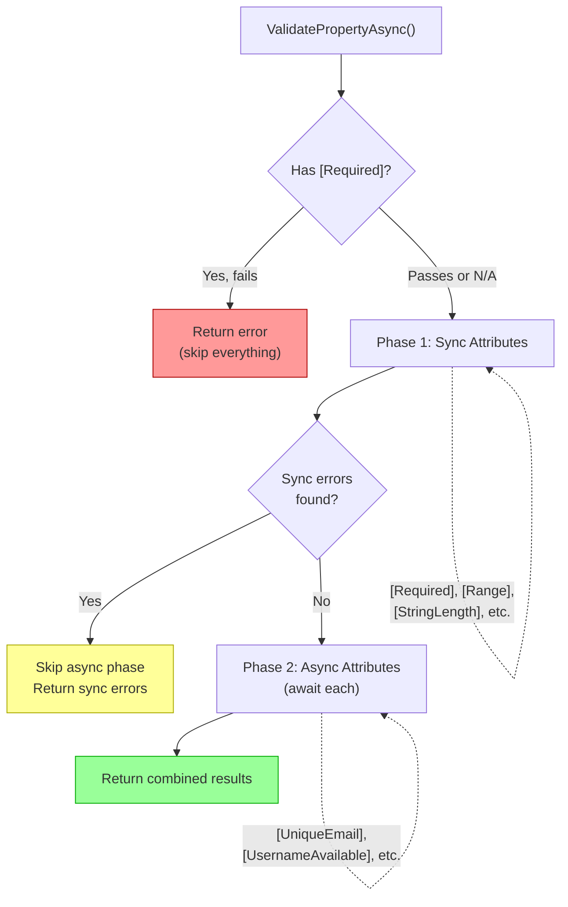

# Chapter 12: The Async Validation Prototype — A Working Demo

> **Key Concept:** The [`oroztocil/validation-demo`](https://github.com/dotnet/aspnetcore/tree/oroztocil/validation-demo) branch in `dotnet/aspnetcore` contains a working prototype that demonstrates how async validation can be integrated into the `Microsoft.Extensions.Validation` pipeline — including new base types, a two-phase validation strategy, and sample applications spanning Console, Minimal API, and Blazor.

## 1. Overview

The demo lives at [https://github.com/dotnet/aspnetcore/tree/oroztocil/validation-demo](https://github.com/dotnet/aspnetcore/tree/oroztocil/validation-demo) under `src/Validation/`. It builds on the `Microsoft.Extensions.Validation` package introduced in .NET 10, extending its pipeline with first-class async validation support.

The branch contains:

- **Core library additions** — New base types (`AsyncValidationAttribute`, `IAsyncValidatableObject`) and two-phase validation logic in `ValidatablePropertyInfo` and `ValidatableTypeInfo`.
- **A source generator** — Extends the existing validation source generator to recognize and emit code for async validation attributes.
- **6 sample applications:**
  - `ConsoleValidationSample` — Manual `ValidateAsync()` invocation via DI.
  - `MinimalApiValidationSample` — Automatic validation through the Minimal API endpoint filter.
  - `BlazorValidationSample` — Blazor integration with `DataAnnotationsValidator`.
  - `BlazorServerDemo` — Interactive server-side Blazor demo.
  - `BlazorSsrDemo` — Server-side rendering Blazor demo.
  - `StandardAttributeLocalization` — Demonstrates localization of validation messages.
- **A `design_public.md` document** — Proposes localization support for validation error messages.

## 2. New Async API Surface

### `AsyncValidationAttribute`

Namespace: `Microsoft.Extensions.Validation`

```csharp
public abstract class AsyncValidationAttribute : ValidationAttribute
{
    protected AsyncValidationAttribute();
    protected AsyncValidationAttribute(string errorMessage);
    protected AsyncValidationAttribute(Func<string> errorMessageAccessor);

    protected abstract Task<ValidationResult?> IsValidAsync(
        object? value,
        ValidationContext validationContext,
        CancellationToken cancellationToken);

    // Sealed — throws NotSupportedException if called directly
    protected sealed override ValidationResult? IsValid(
        object? value, ValidationContext validationContext);

    // Internal pipeline entry point
    internal Task<ValidationResult?> GetValidationResultAsync(
        object? value,
        ValidationContext validationContext,
        CancellationToken cancellationToken);
}
```

Key design points:

- Derives from `ValidationAttribute`, preserving the familiar attribute model.
- The abstract `IsValidAsync()` method is the single override point for subclass authors.
- The synchronous `IsValid(object?, ValidationContext)` override is **sealed** and **throws `NotSupportedException`** — this prevents accidental use through the classic sync `Validator` pipeline.
- The internal `GetValidationResultAsync()` method mirrors the pattern of the base class's `GetValidationResult()`, serving as the pipeline entry point that handles error message formatting and validation context setup.
- Three constructors mirror the `ValidationAttribute` constructor overloads: parameterless, string error message, and `Func<string>` error message accessor.

**Example: A custom async attribute for uniqueness checking**

```csharp
public sealed class UniqueEmailAttribute : AsyncValidationAttribute
{
    protected override async Task<ValidationResult?> IsValidAsync(
        object? value, ValidationContext validationContext, CancellationToken cancellationToken)
    {
        if (value is not string email)
            return ValidationResult.Success;

        var db = validationContext.GetRequiredService<IUserRepository>();
        var exists = await db.EmailExistsAsync(email, cancellationToken);

        return exists
            ? new ValidationResult($"'{email}' is already taken.",
                new[] { validationContext.MemberName! })
            : ValidationResult.Success;
    }
}
```

### `IAsyncValidatableObject`

Namespace: `Microsoft.Extensions.Validation`

```csharp
public interface IAsyncValidatableObject
{
    Task<IEnumerable<ValidationResult>> ValidateAsync(
        ValidationContext validationContext,
        CancellationToken cancellationToken);
}
```

Key design points:

- Async counterpart to `IValidatableObject`.
- Single method: `ValidateAsync(ValidationContext, CancellationToken)`.
- Called after all property-level validation completes, mirroring the positioning of `IValidatableObject` in the existing pipeline.
- Returns `IEnumerable<ValidationResult>` (not `IAsyncEnumerable`) — this matches the existing `IValidatableObject` return type pattern and keeps the pipeline simpler.

**Example: Object-level async validation**

```csharp
public class Registration : IAsyncValidatableObject
{
    public string Email { get; set; }
    public string Username { get; set; }

    public async Task<IEnumerable<ValidationResult>> ValidateAsync(
        ValidationContext validationContext, CancellationToken cancellationToken)
    {
        var db = validationContext.GetRequiredService<IUserRepository>();
        var errors = new List<ValidationResult>();

        if (await db.EmailExistsAsync(Email, cancellationToken))
            errors.Add(new ValidationResult("Email is taken.", new[] { nameof(Email) }));

        return errors;
    }
}
```

## 3. The Two-Phase Validation Strategy

This is the architecturally critical innovation of the prototype. The `ValidatablePropertyInfo.ValidateValueAsync()` method implements a deliberate **two-phase approach** to property-level validation:

### Phase 1: Run All Synchronous Validation Attributes First

The method iterates through all validation attributes on the property, **skipping** any `AsyncValidationAttribute` instances. For each synchronous attribute that fails, the error is reported immediately.

### Phase 2: Run Async Attributes ONLY If No Sync Errors Were Found

If Phase 1 produced any errors for this property, the async validators are **skipped entirely**. This is a deliberate design decision — synchronous validation catches cheap, local errors first (format checks, range checks, required fields), and expensive async checks (database lookups, API calls) only run when the basic validation passes.

```csharp
// Phase 1: Run all sync validation attributes.
for (var i = 0; i < validationAttributes.Length; i++)
{
    var attribute = validationAttributes[i];
    if (attribute is AsyncValidationAttribute) continue;

    var result = attribute.GetValidationResult(val, context.ValidationContext);
    if (result is not null && result != ValidationResult.Success)
        ReportError(attribute, result, ...);
}

// Phase 2: Run async attributes only if no sync errors were found for this property.
var currentErrorCount = context.ValidationErrors?.Count ?? 0;
if (currentErrorCount > originalErrorCount) return;

for (var i = 0; i < validationAttributes.Length; i++)
{
    if (validationAttributes[i] is not AsyncValidationAttribute asyncAttribute) continue;

    var result = await asyncAttribute.GetValidationResultAsync(
        val, context.ValidationContext, cancellationToken);
    if (result is not null && result != ValidationResult.Success)
        ReportError(asyncAttribute, result, ...);
}
```

### Two-Phase Flow Diagram



The two-phase strategy provides three benefits:

1. **Performance** — Avoids unnecessary I/O when basic validation already fails.
2. **User experience** — Users see simple errors (like "Email is required") before slower async errors (like "Email is already taken").
3. **Cost** — Prevents wasteful database or API calls that would just be accompanied by other validation failures.

## 4. The Full Validation Pipeline (ValidatableTypeInfo.ValidateAsync)

The `ValidatableTypeInfo.ValidateAsync()` method orchestrates the complete validation pipeline for an object. The pipeline runs in this order:

1. **Property-level validation (members)** — Each property runs the two-phase sync/async strategy described above.
2. **Inherited type member validation (super types)** — Validates members declared on base types.
3. **Short-circuit** — If any property-level errors were found in steps 1 or 2, return early without running type-level validation.
4. **Type-level attributes** — Class-level validation attributes (attributes on the type itself, not its properties).
5. **`IValidatableObject.Validate()`** — The existing sync interface for object-level validation.
6. **`IAsyncValidatableObject.ValidateAsync()`** — The new async interface for object-level validation.

This parallels but extends the existing 3-step pipeline from `System.ComponentModel.DataAnnotations.Validator`:

| Classic `Validator` Pipeline | `Microsoft.Extensions.Validation` Pipeline |
|---|---|
| 1. Property-level attributes (`[Required]` first) | 1. Property-level attributes (`[Required]` first) + async attributes (two-phase) |
| 2. Type-level attributes | 2. Inherited members, 3. Short-circuit, 4. Type-level attributes |
| 3. `IValidatableObject.Validate()` | 5. `IValidatableObject.Validate()`, 6. `IAsyncValidatableObject.ValidateAsync()` |

The short-circuit behavior in step 3 is important — it means that if a `[Required]` attribute fails on any property, the type-level validators and `IAsyncValidatableObject.ValidateAsync()` are never called. This is consistent with the existing `Validator` behavior where property errors prevent type-level validation from running.

## 5. Sample Application Walkthrough

### Console Sample

The `ConsoleValidationSample` demonstrates manual async validation through dependency injection. The `DemoService` class shows the full ceremony required to invoke the validation pipeline outside of a framework like ASP.NET Core:

```csharp
var validationContext = new ValidationContext(instance, serviceProvider, null);
var validateContext = new ValidateContext
{
    ValidationContext = validationContext,
    ValidationOptions = validationOptions
};

if (!validationOptions.TryGetValidatableTypeInfo(typeof(T), out var typeInfo))
    logger.LogError("Cannot resolve validatable type info.");

await typeInfo!.ValidateAsync(instance, validateContext, cancellationToken);
```

This pattern:

1. Creates a `ValidationContext` (the classic DataAnnotations context) with the service provider for DI resolution.
2. Wraps it in a `ValidateContext` (the Extensions.Validation context) with the `ValidationOptions` that contain the source-generated type metadata.
3. Resolves the `ValidatableTypeInfo` for the target type from the options.
4. Calls `ValidateAsync()` on the type info, which runs the full pipeline.

### Minimal API Sample

The `MinimalApiValidationSample` demonstrates how `AddValidation()` combined with the existing endpoint filter makes async validation automatic for Minimal API endpoints:

```csharp
builder.Services.AddValidation();
builder.Services.AddValidationLocalization();

// Validation is automatic on this route
app.MapPost("/customers", (Customer customer) =>
    TypedResults.Created($"/customers/{customer.Name}", customer));

// DisableValidation() bypasses it
app.MapPost("/products", (...) => ...).DisableValidation();
```

When a request arrives at the `/customers` endpoint, the validation endpoint filter:

1. Deserializes the request body into a `Customer` instance.
2. Resolves the `ValidatableTypeInfo` for `Customer`.
3. Calls `ValidateAsync()`, running the full two-phase pipeline.
4. Returns a `400 Bad Request` with a `ProblemDetails` response if validation fails.
5. Proceeds to the endpoint handler if validation passes.

The `DisableValidation()` extension method opts specific endpoints out of automatic validation.

### Blazor Sample

The `BlazorValidationSample` demonstrates Blazor integration with localization support:

```csharp
builder.Services.AddRazorComponents().AddInteractiveServerComponents();
builder.Services.AddValidation();
builder.Services.AddValidationLocalization<ValidationMessages>();
```

In this configuration:

- `AddValidation()` registers the source-generated type metadata and validation pipeline.
- `AddValidationLocalization<ValidationMessages>()` registers a resource type for localizing validation error messages.
- The existing `DataAnnotationsValidator` component in Blazor forms picks up the validation pipeline, enabling async validation attributes to work in Blazor forms.

## 6. What Lives Where — And What's Still Missing

| Component | Demo Branch Status | Notes |
|---|---|---|
| `AsyncValidationAttribute` | ✅ Implemented | In `Microsoft.Extensions.Validation` (not in core DataAnnotations) |
| `IAsyncValidatableObject` | ✅ Implemented | In `Microsoft.Extensions.Validation` (not in core DataAnnotations) |
| `ValidatablePropertyInfo` two-phase | ✅ Implemented | Sync-first, then async |
| `ValidatableTypeInfo` pipeline | ✅ Implemented | Includes `IAsyncValidatableObject` call |
| Minimal API integration | ✅ Working | Via existing endpoint filter |
| Blazor integration | ✅ Working | Via `DataAnnotationsValidator` |
| Console/DI integration | ✅ Working | Manual `ValidateAsync()` calls |
| Core `Validator` class async methods | ❌ Not done | `TryValidateObjectAsync()` etc. not added |
| `ValidationAttribute.IsValidAsync` | ❌ Not done | Not added to base class in `System.ComponentModel.DataAnnotations` |
| MVC `DataAnnotationsModelValidator` | ❌ Not done | MVC has separate pipeline |
| Options `DataAnnotationValidateOptions` | ❌ Not done | Still sync-only |
| Options Source Generator | ❌ Not done | Still emits sync code |
| Sync fallback behavior | ❌ Not done | No "Checking..." message when sync path hits async validator |

The "✅ Implemented" items all live within the `Microsoft.Extensions.Validation` layer in `dotnet/aspnetcore`. The "❌ Not done" items would require changes either in `dotnet/runtime` (for the core `Validator` class and `System.ComponentModel.DataAnnotations`) or in additional integration points across both repositories.

## 7. Key Design Decisions and Tradeoffs

### Sealed `IsValid` Override That Throws

The demo's `AsyncValidationAttribute` **seals** the synchronous `IsValid(object?, ValidationContext)` override and throws `NotSupportedException` from it. This means:

- `AsyncValidationAttribute` subclasses **cannot** be used with `Validator.TryValidateObject()` — the classic sync validation path.
- Any code that attempts to use an async validation attribute through the synchronous pipeline will get an immediate, clear exception rather than silently incorrect behavior.
- This is a **different approach** from the tenet described in Chapter 9, which proposed returning an invalid result with a "Checking..." placeholder message when the sync path encounters an async validator. The demo takes a stricter stance: async validators are simply incompatible with the sync pipeline.

### New Types in `Microsoft.Extensions.Validation`, Not in `System.ComponentModel.DataAnnotations`

The `AsyncValidationAttribute` and `IAsyncValidatableObject` types live in the `dotnet/aspnetcore` repository under `Microsoft.Extensions.Validation`, not in the core `System.ComponentModel.DataAnnotations` namespace in `dotnet/runtime`. This means:

- They are **only usable** within the `Microsoft.Extensions.Validation` pipeline.
- They are **not available** to the classic `Validator` class or to frameworks that depend on core DataAnnotations directly.
- This is a pragmatic choice — the `Microsoft.Extensions.Validation` pipeline was designed from the start to support async, while retrofitting async into the classic `Validator` class requires careful API design and broader consensus.

### Two-Phase Is Optimization, Not Just Correctness

The two-phase strategy (sync first, then async only if sync passes) is primarily an **optimization**:

- Synchronous validators are cheap — they check format, length, range, and required fields using in-memory operations.
- Asynchronous validators are expensive — they call databases, external APIs, or other I/O-bound services.
- Skipping async validators when sync validators already fail avoids unnecessary I/O, reducing latency and cost.
- It also improves user experience — users see immediate feedback about basic errors before waiting for slower async checks.

### `CancellationToken` Throughout

Every async method in the prototype accepts a `CancellationToken`:

- `AsyncValidationAttribute.IsValidAsync()` receives a cancellation token.
- `AsyncValidationAttribute.GetValidationResultAsync()` propagates it.
- `IAsyncValidatableObject.ValidateAsync()` receives a cancellation token.
- `ValidatablePropertyInfo.ValidateValueAsync()` propagates it to each async attribute.
- `ValidatableTypeInfo.ValidateAsync()` propagates it through the entire pipeline.

This enables proper cancellation of long-running validators — for example, when a user navigates away from a form or when a request times out.

## 8. Connecting to the Broader Async Validation Vision

The demo branch represents a **partial implementation** focused on the `Microsoft.Extensions.Validation` layer. Referencing back to [Chapter 9](09-async-validation-design.md)'s proposed design:

- The demo **validates the core concepts** — two-phase execution works, an async attribute base class works, and the pipeline can be extended to support async validation without breaking existing sync validators.
- The demo does **not address** the `System.ComponentModel.DataAnnotations` layer — the `Validator` class in `dotnet/runtime` has no new async methods (`TryValidateObjectAsync`, `ValidateObjectAsync`, etc.).
- The demo does **not address** sync fallback behavior — when an `AsyncValidationAttribute` is encountered through a sync code path, it throws rather than returning a placeholder result.

For the complete async validation project, each integration point from [Chapter 11](11-integration-history.md) must be assessed for what changes are needed. The full vision would require:

- **`System.ComponentModel.DataAnnotations` changes** (in `dotnet/runtime`) — Adding `ValidationAttribute.IsValidAsync()`, async `Validator` methods, and sync fallback behavior.
- **MVC integration** — Updating `DataAnnotationsModelValidator` and the model binding pipeline to support async validation.
- **Options integration** — Adding async support to `DataAnnotationValidateOptions<T>` and the Options validation source generator.
- **Blazor integration** — While the demo shows Blazor working through `Microsoft.Extensions.Validation`, deeper integration with `EditContext` and `FieldState` may be needed for real-time field-level async validation.
- **Integration point assessment** — Each integration point cataloged in [Appendix A](appendix-a-integration-points.md) needs evaluation for async compatibility, fallback behavior, and migration path.

The demo branch serves as a **proof of concept** that the two-phase, async-aware validation pipeline is viable and can be integrated into real application scenarios. It provides a concrete foundation for the broader design discussions that will shape async validation across the .NET ecosystem.

---
[<<-- Previous: The History of DataAnnotations Integration Across .NET](11-integration-history.md) | [Table of Contents](README.md) | [Next: Appendix A: .NET Integration Points Catalog -->>](appendix-a-integration-points.md)
---
