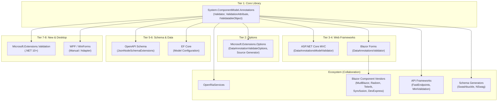

# Appendix A: .NET Integration Points Catalog

<nav>

<a href="../chapters/13-object-graph-validation.md">← Previous: Object Graph Validation</a> | <a href="../README.md">Table of Contents</a> | <a href="appendix-b-references.md">Next: Appendix B: Complete Reference Link Library →</a>

</nav>

Every location across the .NET product suite where DataAnnotations validation is invoked or respected. **Each is a location that must be updated to support async validation.**

## Tier 1: Core Validation Library (dotnet/runtime)

| Component | Location | How It Invokes Validation |
|-----------|----------|--------------------------|
| **`Validator` class** | `System.ComponentModel.Annotations` | Central orchestrator: `TryValidateObject`, `ValidateObject`, `TryValidateProperty`, `ValidateProperty`, `TryValidateValue`, `ValidateValue` |
| **`ValidationAttribute.GetValidationResult`** | `System.ComponentModel.Annotations` | Called by Validator to execute individual attribute validation |
| **`IValidatableObject.Validate`** | `System.ComponentModel.Annotations` | Called by Validator as the final validation stage |

## Tier 2: Microsoft.Extensions.Options (dotnet/runtime)

| Component | Location | How It Invokes Validation |
|-----------|----------|--------------------------|
| **`DataAnnotationValidateOptions<T>`** | `Microsoft.Extensions.Options.DataAnnotations` | Calls `Validator.TryValidateObject(...)` on options instances; recursively validates nested members |
| **`OptionsBuilderDataAnnotationsExtensions`** | `Microsoft.Extensions.Options.DataAnnotations` | `.ValidateDataAnnotations()` registers `DataAnnotationValidateOptions<T>` |
| **Options Source Generator** | `Microsoft.Extensions.Options` (gen) | Emits `Validator.TryValidateValue(...)` and `IValidatableObject.Validate(...)` in generated code |
| **`ValidateOptionsResultBuilder`** | `Microsoft.Extensions.Options` | Consumes `ValidationResult` objects, converts to `ValidateOptionsResult` |
| **`ValidateOnStart`** | `Microsoft.Extensions.Options` | Triggers validation at host startup |

## Tier 3: ASP.NET Core MVC (dotnet/aspnetcore)

| Component | Location | How It Invokes Validation |
|-----------|----------|--------------------------|
| **`DataAnnotationsModelValidator`** | `Microsoft.AspNetCore.Mvc.DataAnnotations` | Calls `Attribute.GetValidationResult(value, context)` per attribute — does NOT use `Validator.TryValidateObject` |
| **`DataAnnotationsModelValidatorProvider`** | `Microsoft.AspNetCore.Mvc.DataAnnotations` | Creates validator instances for attributes on model properties |
| **`ValidatableObjectAdapter`** | `Microsoft.AspNetCore.Mvc.DataAnnotations` | Invokes `IValidatableObject.Validate(context)` |
| **Model Binding Pipeline** | `Microsoft.AspNetCore.Mvc.Core` | Orchestrates validators during binding, populates ModelState |
| **`[ApiController]` auto-validation** | `Microsoft.AspNetCore.Mvc.Core` | Returns 400 when ModelState.IsValid is false |
| **`[Remote]` attribute** | `Microsoft.AspNetCore.Mvc.ViewFeatures` | AJAX property validation (browser-only) |

## Tier 4: Blazor (dotnet/aspnetcore)

| Component | Location | How It Invokes Validation |
|-----------|----------|--------------------------|
| **`DataAnnotationsValidator`** | `Microsoft.AspNetCore.Components.Forms` | Attaches to EditContext |
| **`EditContextDataAnnotationsExtensions`** | `Microsoft.AspNetCore.Components.Forms` | Field changes: `Validator.TryValidateProperty(...)`; form submit: `Validator.TryValidateObject(...)` |
| **`EditContext` / `ValidationMessageStore`** | `Microsoft.AspNetCore.Components.Forms` | Manages validation state, displays messages |

## Tier 5: OpenAPI / Swagger (dotnet/aspnetcore)

| Component | Location | How It Uses Validation Attributes |
|-----------|----------|-----------------------------------|
| **`JsonNodeSchemaExtensions`** | `Microsoft.AspNetCore.OpenApi` | Maps `[Range]` → min/max, `[MaxLength]`/`[MinLength]` → maxLength/minLength, `[StringLength]` → both, `[Required]` → required |
| **Swashbuckle** | Third-party NuGet | Similarly reads DataAnnotations for schema |
| **NSwag** | Third-party NuGet | Similarly reads DataAnnotations for schema |

## Tier 6: Entity Framework Core (dotnet/efcore)

| Component | How It Uses Validation Attributes |
|-----------|-----------------------------------|
| **Model configuration** | Reads `[Required]`, `[MaxLength]`, `[StringLength]`, `[Key]`, etc. for schema generation and migration |
| **Runtime validation** | EF Core does **NOT** run general DataAnnotations validation on save; uses attributes for model/schema configuration only |

## Tier 7: Microsoft.Extensions.Validation (.NET 10+)

| Component | Location | How It Invokes Validation |
|-----------|----------|--------------------------|
| **`AddValidation()` extension** | `Microsoft.Extensions.Validation` | Unified validation registration for DI; available outside HTTP scenarios |
| **Validation infrastructure** | `Microsoft.Extensions.Validation` | New .NET 10 package — APIs moved from ASP.NET Core |

## Tier 8: WPF (dotnet/wpf)

| Component | How It Uses Validation |
|-----------|----------------------|
| **Data Binding** | Uses `ValidationRule`, `IDataErrorInfo`, `INotifyDataErrorInfo` — not DataAnnotations natively |
| **Community adapters** | Various libraries bridge DataAnnotations to WPF binding validation |

## Tier 9: WinForms (dotnet/winforms)

| Component | How It Uses Validation |
|-----------|----------------------|
| **`Validating` events / `ErrorProvider`** | Event-based; DataAnnotations not the native mechanism |
| **Manual integration** | Requires explicit `Validator.TryValidateObject()` calls |

## Tier 10: .NET Aspire / Configuration

| Component | How It Uses Validation |
|-----------|----------------------|
| **`ValidateDataAnnotations()` + `ValidateOnStart()`** | Options pattern using `DataAnnotationValidateOptions<T>` |
| **Aspire service defaults** | Common pattern: `builder.Services.AddOptions<T>().ValidateDataAnnotations().ValidateOnStart()` |

## Tier 11: Minimal APIs

| Component | How It Uses Validation |
|-----------|----------------------|
| **No built-in validation** | Minimal APIs do NOT have automatic model validation |
| **Manual or library-based** | Developers call `Validator.TryValidateObject()` manually |

## Ecosystem: External Projects with DataAnnotations Integration

These projects are outside the core .NET product suite but have direct integration with DataAnnotations validation. Changes to the core validation APIs (especially adding async support) will affect them. Collaboration and communication with these projects is essential.

### OpenRiaServices (.NET Foundation)

| Component | How It Uses Validation |
|-----------|----------------------|
| **`Entity.ValidateProperty()`** | Calls `Validator.TryValidateProperty()` in property setters |
| **`ValidationUtilities.TryValidateObject()`** | Wrapper around `Validator.TryValidateObject()` with recursive complex-type support |
| **`DomainService.ValidateChangeSetAsync()`** | Server-side changeset validation via `ValidateOperations()` → `Validator.TryValidateObject()` |
| **`ValidationResultCollection`** | Mutable collection implementing `INotifyDataErrorInfo` for async error injection |

[OpenRiaServices][openria] is the actively maintained successor to WCF RIA Services, targeting .NET 8+ and .NET Framework 4.7.2. It is a .NET Foundation project with its own recursive validation pipeline built on top of `Validator`. As a direct consumer of the core validation APIs, any async changes to `ValidationAttribute` or `Validator` will impact OpenRiaServices.

### Blazor Component Vendors

These UI component libraries build on Blazor's `EditContext` and `DataAnnotationsValidator`, meaning they inherit the same validation behavior (and limitations):

| Vendor | How It Uses Validation |
|--------|----------------------|
| **[MudBlazor][mudblazor]** | Field-level: calls `ValidationAttribute.GetValidationResult()` directly; form-level: aggregates via `MudForm` |
| **[Radzen Blazor][radzen]** | Custom `RadzenDataAnnotationValidator` calls `Validator.TryValidateProperty()` directly |
| **[Telerik UI for Blazor][telerik-blazor]** | `TelerikForm` wraps standard `EditForm` + `DataAnnotationsValidator`; uses `EditContext.Validate()` |
| **[Syncfusion Blazor][syncfusion]** | `SfDataForm` uses `<DataAnnotationsValidator/>` within its form infrastructure |
| **[DevExpress Blazor][devexpress]** | Grid and form components use standard `DataAnnotationsValidator`; supports custom validator templates |

All of these vendors will benefit from async validation support in `EditContext` and `DataAnnotationsValidator` without requiring coordinated code changes — assuming the Blazor integration maintains backward compatibility.

### API Frameworks

| Framework | How It Uses Validation |
|-----------|----------------------|
| **[FastEndpoints][fastendpoints]** | Optional `EnableDataAnnotationsSupport`; recursive request validation via `Validator.TryValidateObject()` |
| **[MiniValidation][minivalidation]** | Built atop DataAnnotations; recursive graph walk with cycle detection; `Validator.TryValidateValue()` per property; supports `IAsyncValidatableObject` |

MiniValidation (by [Damian Edwards][damian-edwards]) is particularly relevant — it already demonstrates a recursive, async-capable validation pattern built on DataAnnotations. See [Chapter 13](../chapters/13-object-graph-validation.md) for details.

### Schema Generators (Metadata Consumers)

| Tool | How It Uses Validation Attributes |
|------|-----------------------------------|
| **[Swashbuckle.AspNetCore][swashbuckle]** | Maps `[Required]`, `[Range]`, `[MinLength]`, `[MaxLength]`, `[RegularExpression]`, `[DataType]` to OpenAPI schema properties |
| **[NSwag][nswag]** | Reads `[Required]` and DataAnnotations attributes for schema and parameter generation |

These tools read validation attributes as metadata only and do not invoke runtime validation. They may need updates to represent new async-specific attributes in generated schemas.

### Other Known Consumers

| Project | How It Uses Validation |
|---------|----------------------|
| **[ServiceStack][servicestack]** | Blazor templates use `EditForm` + `DataAnnotationsValidator`; HTML helpers emit unobtrusive validation attributes |
| **[FluentValidation][fluentvalidation]** | Independent validation framework; does not consume DataAnnotations attributes directly but provides MVC integration that replaces the DataAnnotations pipeline |

## Summary: Invocation Paths That Need Async Support

1. **`Validator` class** — Core static methods (dotnet/runtime)
2. **`ValidationAttribute.IsValid` / `GetValidationResult`** — Individual attribute execution (dotnet/runtime)
3. **`IValidatableObject.Validate`** — Object self-validation (dotnet/runtime)
4. **`DataAnnotationValidateOptions<T>`** — Options validation (dotnet/runtime)
5. **Options Source Generator** — Generated validation code (dotnet/runtime)
6. **`DataAnnotationsModelValidator`** — MVC model validation (dotnet/aspnetcore)
7. **`ValidatableObjectAdapter`** — MVC IValidatableObject (dotnet/aspnetcore)
8. **`EditContextDataAnnotationsExtensions`** — Blazor form validation (dotnet/aspnetcore)
9. **`Microsoft.Extensions.Validation`** — .NET 10 unified validation (dotnet/aspnetcore)
10. **OpenAPI schema generation** — May need schema representation for async validators
11. **Any future Minimal API validation** — If built-in validation is added

## Ecosystem Collaboration Points

These are not owned by the .NET team but must be considered in the async validation design:

12. **OpenRiaServices** — Direct consumer of `Validator.TryValidateObject/Property()` with its own recursive pipeline (collaboration via .NET Foundation)
13. **Blazor component vendors** — MudBlazor, Radzen, Telerik, Syncfusion, DevExpress all build on `EditContext`/`DataAnnotationsValidator` (will inherit async support if Blazor integration is backward-compatible)
14. **FastEndpoints** — Calls `Validator.TryValidateObject()` recursively for request validation
15. **MiniValidation** — Recursive graph validation atop DataAnnotations; already has `IAsyncValidatableObject`
16. **Swashbuckle / NSwag** — Metadata consumers that may need to represent async validators in schemas

<nav>

<a href="../chapters/13-object-graph-validation.md">← Previous: Object Graph Validation</a> | <a href="../README.md">Table of Contents</a> | <a href="appendix-b-references.md">Next: Appendix B: Complete Reference Link Library →</a>

</nav>

<!-- Reference definitions -->

[openria]: https://github.com/OpenRIAServices/OpenRiaServices
[mudblazor]: https://github.com/MudBlazor/MudBlazor
[radzen]: https://github.com/radzenhq/radzen-blazor
[telerik-blazor]: https://github.com/telerik/blazor-ui
[syncfusion]: https://github.com/syncfusion/blazor-samples
[devexpress]: https://github.com/DevExpress/Blazor
[fastendpoints]: https://github.com/FastEndpoints/FastEndpoints
[minivalidation]: https://github.com/DamianEdwards/MiniValidation
[damian-edwards]: https://github.com/DamianEdwards
[swashbuckle]: https://github.com/domaindrivendev/Swashbuckle.AspNetCore
[nswag]: https://github.com/RicoSuter/NSwag
[servicestack]: https://github.com/ServiceStack/ServiceStack
[fluentvalidation]: https://github.com/FluentValidation/FluentValidation
