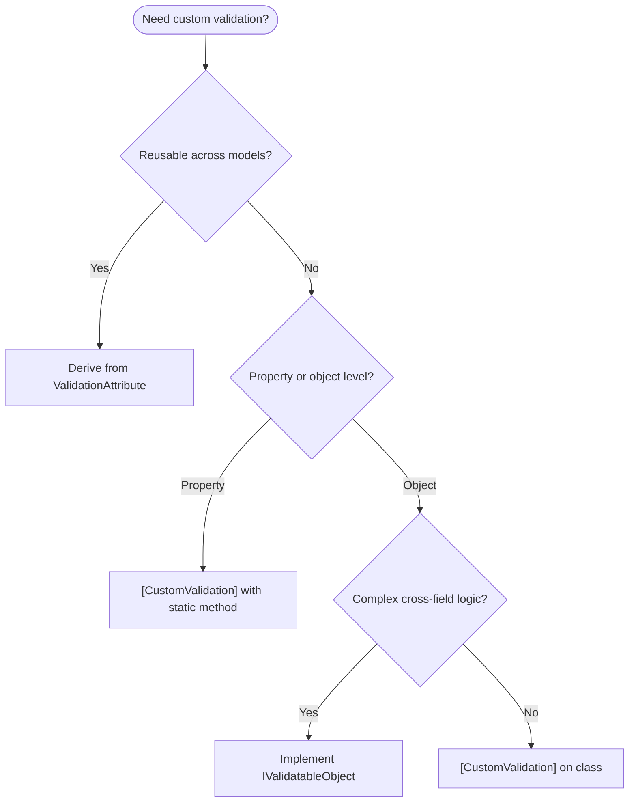

# Chapter 6: Advanced Custom Validation

<nav>

<a href="05-aspnet-mvc-validation.md">← Previous: ASP.NET MVC Automatic Validation</a> | <a href="../README.md">Table of Contents</a> | <a href="07-validation-context.md">Next: ValidationContext Deep Dive →</a>

</nav>

Beyond the built-in validation attributes, DataAnnotations provides several extensibility mechanisms for custom business rules — from self-validating objects to reusable cross-field validators.

> **Key References:** [Entity-Level Validation][entity-level-validation] · [IValidatableObject Interface API][ivalidatableobject-api]

## IValidatableObject — Self-Validating Objects

The `IValidatableObject` interface is the **most powerful extensibility point** in the DataAnnotations system. It runs last in the validation pipeline (Step 3), has full access to the object's state, and can yield multiple validation results.

```csharp
public interface IValidatableObject
{
    IEnumerable<ValidationResult> Validate(ValidationContext validationContext);
}
```

Because it runs after all property-level and type-level attributes have passed, your `Validate` method can safely assume that individual property constraints are already satisfied.

### Full Example

```csharp
public class Meeting : IValidatableObject
{
    [Required]
    public DateTime Start { get; set; }

    [Required]
    public DateTime End { get; set; }

    [Range(2, 100)]
    public int MinimumAttendees { get; set; }

    [Range(2, 100)]
    public int MaximumAttendees { get; set; }

    public IEnumerable<ValidationResult> Validate(ValidationContext validationContext)
    {
        if (Start >= End)
        {
            yield return new ValidationResult(
                "End time must be after start time.",
                new[] { nameof(Start), nameof(End) });
        }

        if (MinimumAttendees > MaximumAttendees)
        {
            yield return new ValidationResult(
                "Minimum attendees cannot exceed maximum.",
                new[] { nameof(MinimumAttendees), nameof(MaximumAttendees) });
        }
    }
}
```

## Why Entity-Level Validation Exists

The [entity-level validation][entity-level-validation] post identifies four key reasons why some validation rules belong at the entity level rather than on individual properties:

1. **No certain data entry path leads to the error** — the rule involves multiple properties, and any of them could be the one to change
2. **No clear guidance on which field to change** — the error applies to the relationship between fields, not a single field
3. **Property-level validation would cause "noise" during editing** — showing a cross-field error while the user is still filling in related fields creates a poor experience
4. **The rule relies on property-level validation succeeding first** — entity-level logic often assumes individual fields are already well-formed (e.g., checking date ranges assumes both dates are valid)

## CustomValidationAttribute at the Entity Level

`[CustomValidation]` can be applied at the class level to invoke a static validation method that receives the entire object.

```csharp
[CustomValidation(typeof(MeetingValidators), "PreventExpensiveMeetings")]
public partial class Meeting { /* ... */ }

public static class MeetingValidators
{
    public static ValidationResult? PreventExpensiveMeetings(Meeting meeting)
    {
        TimeSpan duration = meeting.End - meeting.Start;
        int attendees = (meeting.MaximumAttendees + meeting.MinimumAttendees) / 2;
        int cost = attendees * 50 * duration.Hours;

        if (cost > 10000)
        {
            return new ValidationResult(
                "Meetings cannot cost the company more than $10,000.");
        }

        return ValidationResult.Success;
    }
}
```

Note the differences from property-level `[CustomValidation]`:

- The method parameter is the **strongly-typed entity** (not `object`)
- An optional second `ValidationContext` parameter can be added if needed
- Member names are typically omitted since the error applies to the whole entity

## Derived Reusable Validators (Cross-Field)

For validation logic that needs to be reused across multiple models, you can derive from an existing `ValidationAttribute`. The following example (from the [Cross-Field Validation][cross-field-validation] post) shows a `ConditionallyRequiredAttribute` — a `RequiredAttribute` derivative that only enforces the requirement when another property has a specific value.

```csharp
[AttributeUsage(
    AttributeTargets.Property | AttributeTargets.Field | AttributeTargets.Parameter,
    AllowMultiple = true)]
public class ConditionallyRequiredAttribute : RequiredAttribute
{
    public string ConditionMember { get; }
    public object RequiredCondition { get; }

    public ConditionallyRequiredAttribute(string conditionMember)
        : this(conditionMember, true) { }

    public ConditionallyRequiredAttribute(string conditionMember, object requiredCondition)
    {
        ConditionMember = conditionMember;
        RequiredCondition = requiredCondition;
    }

    protected override ValidationResult? IsValid(
        object? value, ValidationContext validationContext)
    {
        // Use reflection to check the condition member's value
        var conditionProperty = validationContext.ObjectType.GetProperty(ConditionMember);
        var conditionValue = conditionProperty?.GetValue(validationContext.ObjectInstance);

        if (Equals(conditionValue, RequiredCondition))
        {
            return base.IsValid(value, validationContext);
        }

        return ValidationResult.Success;
    }
}
```

### Usage

```csharp
[ConditionallyRequired("IsLongMeeting",
    ErrorMessage = "Provide an agenda for meetings over an hour.")]
public string Details { get; set; }

[ConditionallyRequired("Location", "18/3367",
    ErrorMessage = "Include directions — no one can find this room.")]
public string Details { get; set; }
```

Because `ConditionallyRequiredAttribute` derives from `RequiredAttribute`, it participates in the first phase of property validation — getting the special short-circuit behavior that `[Required]` attributes receive.

## Decision Tree: Which Approach to Use



## Summary

| Approach | Best For | Runs When |
|----------|----------|-----------|
| Derived ValidationAttribute | Reusable validators across many models | With other property/type attributes |
| [CustomValidation] | One-off business logic | With other property/type attributes |
| IValidatableObject | Complex object-level logic | Last — only after all attributes pass |

<nav>

<a href="05-aspnet-mvc-validation.md">← Previous: ASP.NET MVC Automatic Validation</a> | <a href="../README.md">Table of Contents</a> | <a href="07-validation-context.md">Next: ValidationContext Deep Dive →</a>

</nav>

[entity-level-validation]: https://jeffhandley.com/2010-10-12/entitylevelvalidation
[ivalidatableobject-api]: https://learn.microsoft.com/en-us/dotnet/api/system.componentmodel.dataannotations.ivalidatableobject
[cross-field-validation]: https://jeffhandley.com/2010-10-10/crossfieldvalidation
