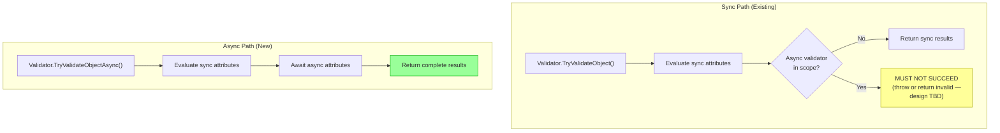

# Chapter 9: The Async Validation Gap

<nav>

<a href="08-validation-result-api.md">← Previous: The ValidationResult API</a> | <a href="../README.md">Table of Contents</a> | <a href="10-strickland.md">Next: Strickland — Parallel Concepts and Async Validation →</a>

</nav>

> **Key Concept:** The entire DataAnnotations validation system is synchronous. There is no async path anywhere in the current API.

## The Problem

Every validation extensibility point is synchronous:

| Interface/Method | Signature | Async? |
|------------------|-----------|--------|
| `ValidationAttribute.IsValid` | `ValidationResult? IsValid(object?, ValidationContext)` | ❌ Sync |
| `IValidatableObject.Validate` | `IEnumerable<ValidationResult> Validate(ValidationContext)` | ❌ Sync |
| `CustomValidationAttribute` methods | `ValidationResult Method(T, ValidationContext)` | ❌ Sync |
| `Validator.TryValidateObject` | `bool TryValidateObject(...)` | ❌ Sync |
| `Validator.ValidateObject` | `void ValidateObject(...)` | ❌ Sync |
| `IValidateOptions<T>.Validate` | `ValidateOptionsResult Validate(string?, T)` | ❌ Sync |

This means it's **impossible** to write validators that:

- Check database uniqueness (e.g., "Is this username available?")
- Call external APIs (e.g., address verification, fraud detection)
- Perform any I/O-bound validation

## Current Workarounds (and Why They're Insufficient)

1. **Block on async** — `.GetAwaiter().GetResult()` — causes deadlocks in synchronization contexts
2. **MVC [Remote] attribute** — AJAX-based, MVC-specific, browser-only
3. **Validate outside DataAnnotations** — Perform async checks separately, merge results manually
4. **IAsyncActionFilter** — ASP.NET MVC specific; doesn't integrate with DataAnnotations pipeline

None are satisfactory for general-purpose validation.

## How RIA Services Handled Async Validation

WCF RIA Services (and its modern successor, [OpenRiaServices][openria]) never added async validators to DataAnnotations. Instead, async validation was handled as a **separate roundtrip pattern** layered on top of the synchronous validation pipeline.

### The Pattern

1. **Synchronous validation ran locally** — On both client and server, property-level and entity-level validation used standard `Validator.TryValidateProperty()` and `Validator.TryValidateObject()` calls. The `Entity` base class called these synchronously in property setters, surfacing errors through `ValidationErrors` and `INotifyDataErrorInfo`.

2. **"Async validation" was an explicit service call** — For checks like username availability, developers created `[Invoke]` methods on the `DomainService`:

   ```csharp
   // Server-side DomainService
   [Invoke]
   public bool IsUsernameAvailable(string username)
   {
       return !UserRepository.Exists(username);
   }
   ```

   The code generation tooling produced async client-side proxy methods (e.g., `IsUsernameAvailableAsync()`), and the client called them explicitly, injecting any resulting errors into the entity's `ValidationErrors` collection.

3. **Mutable error collections bridged the gap** — `ValidationResultCollection` supported `Add()`, `Remove()`, and `ReplaceErrors()`, firing `INotifyDataErrorInfo.ErrorsChanged` events. This allowed async results to flow into the UI at any time — the UI simply reacted to collection changes.

### Why It Worked (and Its Limitations)

This pattern worked in the RIA Services context because:

- **Silverlight's `INotifyDataErrorInfo`** (introduced in Silverlight 4 / .NET 4.5) was designed for exactly this scenario — it expected errors to arrive asynchronously and the UI to react to changes
- **The client-server architecture** naturally separated the sync local validation from async remote checks
- **Code generation** handled the boilerplate of creating async proxy methods

But it had significant limitations:

- Async validation was **not part of the validation pipeline** — it was a completely separate code path
- The `[Invoke]` approach required **manual orchestration** — developers had to wire up the async call, handle the response, and inject errors themselves
- There was **no unified "validate everything"** call that included both sync and async validators
- The pattern was **tightly coupled to the RIA Services architecture** — it didn't generalize to other frameworks

### The Submit Pipeline

On the server side, `DomainService.SubmitAsync()` called `ValidateChangeSetAsync()`, which despite its async signature, ran validation synchronously via `ValidateOperations()`. The "async" in the method name reflected the overall submit pipeline, not async validation itself. Each entity in the changeset was validated with `ValidationUtilities.TryValidateObject()` — a wrapper around the standard `Validator.TryValidateObject()`.

See [OpenRiaServices on GitHub][openria] for the modern, actively-maintained continuation of this codebase, which targets .NET 8+ and is a .NET Foundation project.

## The Proposed Design Tenet

> If synchronous validation is invoked, but there is an async validator in scope, validation **must not succeed**. Whether the sync path should throw an exception or return an invalid result is an open design question — but it must never silently report success when async validation remains unexecuted.

Example: A `[UsernameAvailable]` validator:

- **Sync invocation:** Must not return success — could throw `NotSupportedException`, or return `isValid: false` with a message like `"Checking username availability..."`
- **Async invocation:** Awaits the async validator and resolves to the final result

## Extensibility Hooks That Need Async Versions

| Current Sync API | Proposed Async Version |
|------------------|------------------------|
| `ValidationAttribute.IsValid(object?, ValidationContext)` | `IsValidAsync(object?, ValidationContext, CancellationToken)` |
| `IValidatableObject.Validate(ValidationContext)` | `IAsyncValidatableObject.ValidateAsync(ValidationContext, CancellationToken)` |
| `CustomValidationAttribute` method signatures | Support `Task<ValidationResult>` return types |
| `Validator.TryValidateObject(...)` | `Validator.TryValidateObjectAsync(...)` |
| `Validator.ValidateObject(...)` | `Validator.ValidateObjectAsync(...)` |
| `Validator.TryValidateProperty(...)` | `Validator.TryValidatePropertyAsync(...)` |
| `Validator.TryValidateValue(...)` | `Validator.TryValidateValueAsync(...)` |
| `IValidateOptions<T>.Validate(...)` | `IValidateOptions<T>.ValidateAsync(...)` |

## Proposed Architecture

The following diagram shows how sync and async paths would coexist:



## What the Async Validation Project Must Touch

Every invocation point across the .NET product suite must gain async support. The key ones:

1. **`System.ComponentModel.Annotations`** — Core Validator class and attribute base classes
2. **`Microsoft.Extensions.Options`** — DataAnnotationValidateOptions and source generator
3. **ASP.NET Core MVC** — DataAnnotationsModelValidator and ValidatableObjectAdapter
4. **Blazor** — EditContextDataAnnotationsExtensions
5. **Microsoft.Extensions.Validation (.NET 10)** — New unified validation APIs
6. **OpenAPI** — Schema generation may need to represent async validators

See [Chapter 11](11-integration-history.md) for the full chronological history of how each integration was added, and [Appendix A](../appendices/appendix-a-integration-points.md) for the complete 11-tier catalog.

> **Prototype available:** A working async validation demo already exists — see [Chapter 12](12-async-validation-demo.md) for a detailed analysis of the `AsyncValidationAttribute`, `IAsyncValidatableObject`, and the two-phase validation strategy implemented in the [oroztocil/validation-demo][validation-demo-branch] branch.

<nav>

<a href="08-validation-result-api.md">← Previous: The ValidationResult API</a> | <a href="../README.md">Table of Contents</a> | <a href="10-strickland.md">Next: Strickland — Parallel Concepts and Async Validation →</a>

</nav>

<!-- Reference definitions -->

[validation-demo-branch]: https://github.com/dotnet/aspnetcore/tree/oroztocil/validation-demo
[openria]: https://github.com/OpenRIAServices/OpenRiaServices
